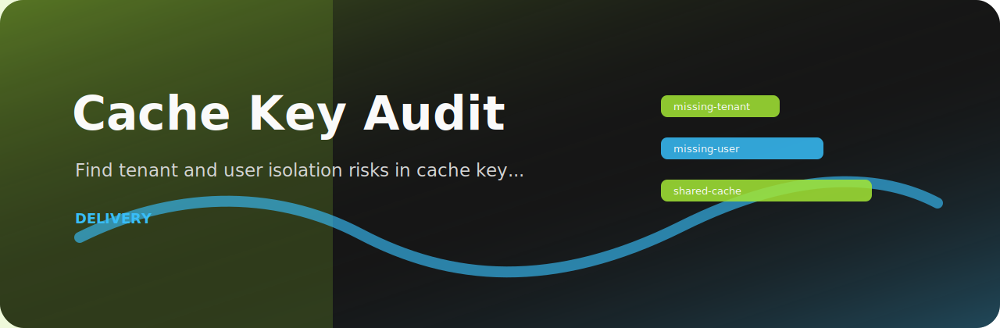
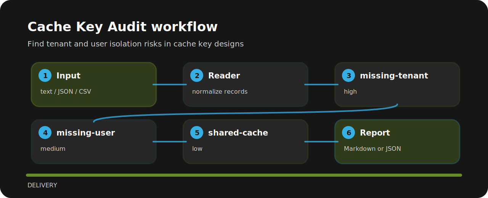

# Cache Key Audit



Cache Key Audit is meant for quick pull-request checks around cache behavior. It favors explicit rules over a bulky dashboard.

## Signal route



## What gets flagged

| Signal | Level | What it flags | Fix direction |
| --- | --- | --- | --- |
| `missing-tenant` | high | tenant dimension is missing | Include tenant or workspace ID in the cache key. |
| `missing-user` | medium | user dimension may be missing | Include user ID for personalized responses. |
| `shared-cache` | low | shared cache is enabled | Confirm response is safe for shared caching. |

## Try the fixture

```bash
git clone https://github.com/mertefekurt/cache-key-audit.git
cd cache-key-audit
python -m pip install -e ".[dev]"
cache-key-audit examples/sample.txt
```

## Example lines

```text
risky: cache key /account/settings tenant missing user missing shared true
clean: cache key tenant:{tenant_id}:user:{user_id}:settings shared false ttl 300
```
